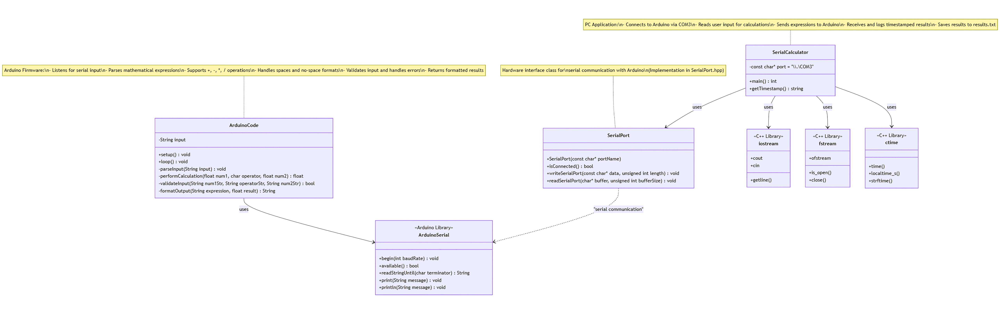

# Serial Calculator System Documentation

## Table of Contents
1. [Overview](#overview)
2. [System Requirements](#system-requirements)
3. [Installation & Setup](#installation--setup)
4. [Console Application Documentation](#console-application-documentation)
5. [Arduino Firmware Documentation](#arduino-firmware-documentation)
6. [Communication Protocol](#communication-protocol)
7. [Troubleshooting](#troubleshooting)
8. [Reference](#reference)

## Overview

The Serial Calculator System is a distributed calculator application consisting of two components:
- **Console Application (PC)**: Handles user interface, input/output, and result logging
- **Arduino Firmware**: Performs mathematical calculations and handles expression parsing

The system uses serial communication to send mathematical expressions from the PC to Arduino, which processes them and returns results.

## System Requirements

### Console Application
- Windows 10/11
- Visual Studio 2019 or later
- Available COM port (typically COM3)
- SerialPort.hpp library

### Arduino
- Arduino Uno, Nano, or compatible board
- Arduino IDE 1.8.x or 2.x
- USB cable for programming and communication

## Installation & Setup

### 1. Arduino Setup
```cpp
// Upload the Arduino firmware to your board
// Default baud rate: 9600
// No external components required
```

### 2. Console Application Setup
1. Create new C++ project in Visual Studio
2. Add `SerialPort.hpp` to project directory
3. Configure COM port in source code:
   ```cpp
   const char* port = "\\\\.\\COM3"; // Change to your port
   ```
4. Build and run the application

### 3. Hardware Connection
- Connect Arduino to PC via USB cable
- Note the assigned COM port in Device Manager
- Update the port variable in console application

## Console Application Documentation

### Project Structure


### Features
- Interactive command-line interface
- Real-time communication with Arduino
- Automatic result logging with timestamps
- Graceful error handling and connection management

### Usage

#### Starting the Application
```
SerialCalculator.exe
```

#### Commands
- **Mathematical Expression**: Enter any supported calculation
  ```
  Enter a calculation (e.g., 5 * 5) or type 'exit' to exit and save the result: 10 + 5
  Result: 10 + 5 = 15
  ```
- **Exit Command**: Type `exit` to close application and save results
  ```
  Enter a calculation (e.g., 5 * 5) or type 'exit' to exit and save the result: exit
  Exiting program. Results saved to results.txt.
  ```

#### Output Files
- **results.txt**: Contains timestamped calculation results
  ```
  [2025-06-29 14:30:25] Result: 10 + 5 = 15
  [2025-06-29 14:30:32] Result: 7 * 8 = 56
  ```

### Error Handling
- **Connection Failure**: Application exits with error code if Arduino connection fails
- **File Access Error**: Displays error message if results.txt cannot be opened
- **Serial Communication Error**: Handles timeout and communication issues

### Functions Reference

#### `main()`
- **Purpose**: Entry point, manages application lifecycle
- **Returns**: `int` - 0 for success, 1 for error
- **Flow**: Initialize serial connection → Open log file → Process user input loop → Cleanup

#### `getTimestamp()`
- **Purpose**: Generates formatted timestamp for logging
- **Returns**: `std::string` - Timestamp in "YYYY-MM-DD HH:MM:SS" format
- **Error Handling**: Returns "[Error getting time]" if timestamp generation fails

## Arduino Firmware Documentation

### Features
- Support for four basic arithmetic operations (+, -, *, /)
- Flexible input parsing (spaces optional)
- Comprehensive error handling
- Floating-point arithmetic with intelligent formatting
- Division by zero protection

### Supported Input Formats

#### With Spaces
```
5 + 3
10 - 4
7 * 8
15 / 3
```

#### Without Spaces
```
5+3
10-4
7*8
15/3
```

#### Negative Numbers
```
-5 + 3
10 + -4
-7 * -8
```

### Functions Reference

#### `setup()`
- **Purpose**: Initialize serial communication
- **Baud Rate**: 9600
- **Behavior**: Waits for serial monitor connection

#### `loop()`
- **Purpose**: Main processing loop
- **Behavior**: 
  - Listens for serial input
  - Parses mathematical expressions
  - Performs calculations
  - Returns formatted results

#### Input Parsing Logic
1. **Trim Input**: Remove whitespace and carriage returns
2. **Detect Format**: Check for spaces between operands
3. **Extract Components**: Parse numbers and operator
4. **Validate**: Ensure all components are present and valid

#### Calculation Engine
```cpp
switch (arithOperator) {
    case '+': result = num1 + num2; break;
    case '-': result = num1 - num2; break;
    case '*': result = num1 * num2; break;
    case '/': 
        if (num2 != 0) result = num1/num2;
        else { /* Handle division by zero */ }
        break;
}
```

### Output Formatting
- **Whole Numbers**: Display as integers (e.g., "15" instead of "15.0000")
- **Decimal Numbers**: Display with 4 decimal places
- **Expression Echo**: Include original expression in result

### Error Messages
- `"Error: Division by zero"` - Division by zero attempted
- `"Error: Invalid operator"` - Unsupported operator used
- `"Error: No valid operator found"` - No operator detected in input
- `"Error: Invalid input format"` - Malformed input string

## Communication Protocol

### Data Flow
1. **PC → Arduino**: Mathematical expression + newline (`\n`)
2. **Arduino → PC**: Formatted result string

### Message Format
- **Input**: `"<num1> <operator> <num2>\n"`
- **Output**: `"Result: <num1> <operator> <num2> = <result>"`

### Timing
- **Send Delay**: 100ms wait after sending to Arduino
- **Processing Time**: Typically < 10ms for calculation
- **Baud Rate**: 9600 bits per second

## Troubleshooting

### Common Issues

#### "Failed to connect to Arduino"
- **Cause**: Incorrect COM port or Arduino not connected
- **Solution**: 
  - Check Device Manager for correct COM port
  - Update port variable in code
  - Ensure Arduino is connected and drivers installed

#### "Could not open results file"
- **Cause**: File permissions or disk space issues
- **Solution**:
  - Run application as administrator
  - Check available disk space
  - Ensure directory is writable

#### Arduino Not Responding
- **Cause**: Arduino not programmed or serial connection issues
- **Solution**:
  - Verify Arduino firmware is uploaded
  - Check serial monitor in Arduino IDE
  - Try different USB cable or port

#### Incorrect Calculations
- **Cause**: Input parsing issues or precision limitations
- **Solution**:
  - Verify input format matches supported patterns
  - Check for extra spaces or characters
  - Understand floating-point precision limits

### Debug Tips
1. **Test Arduino Separately**: Use Arduino IDE Serial Monitor
2. **Check COM Port**: Verify correct port in Device Manager
3. **Monitor Results File**: Check if logging is working
4. **Test Simple Expressions**: Start with basic calculations

## Reference

### SerialPort Class (External Library)
```cpp
class SerialPort {
public:
    SerialPort(const char* portName);
    bool isConnected();
    void writeSerialPort(const char* data, unsigned int length);
    void readSerialPort(char* buffer, unsigned int bufferSize);
};
```

### Arduino String Methods Used
```cpp
String.trim()              // Remove whitespace
String.replace(old, new)   // Replace characters
String.indexOf(char)       // Find character position
String.lastIndexOf(char)   // Find last occurrence
String.substring(start, end) // Extract substring
String.toFloat()          // Convert to float
String.charAt(index)      // Get character at index
```

### Standard Library Functions
```cpp
time_t time(nullptr)                    // Get current time
localtime_s(tm*, time_t*)              // Convert to local time
strftime(char*, size_t, format, tm*)   // Format time string
Sleep(milliseconds)                    // Windows sleep function
```

---